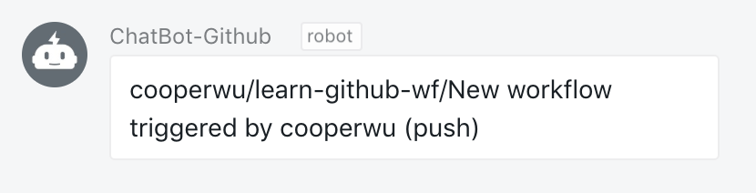

# DingTalk for GitHub Actions

Sends a DingTalk notification. Simple as that.


*Appearance on Dingtalk :*



<hr/>

## Usage

```hcl
action "Dingtalk notification" {
  uses = "cooperwu/action-dingtalk@master"
  secrets = ["DINGTALK_WEBHOOK"]
  args = "A new commit has been pushed."
}
```

### Arguments

The argument is the message to display in the Slack notification.

**Environment variables** can be interpolated in the message using brackets (`{{` and `}}`) :

e.g.: `Action called : {{ GITHUB_ACTION }}`

*Note :* be careful to properly [format your messages for Slack](https://api.slack.com/docs/message-formatting).

#### Examples

* `args = "Hello, beautiful ! I ran a GitHub Actions for you <3"`
* `args = "I showed you my commit. Please respond."`

### Secrets

* **`DINGTALK_WEBHOOK`**: the Dingtalk webhook URL (**required**, see https://open-doc.dingtalk.com/docs/doc.htm).
* That's all.

### Credits

This repo is inspired by Ilshidur, forked from his [Slack action](https://github.com/Ilshidur/action-slack) 
